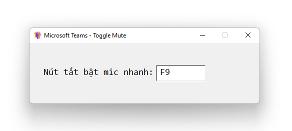

# ToggleMute

Phần mềm bật tắt mic nhanh cho Microsoft Teams

Hiện tại để bật tắt mic của Teams ta dùng hot key : Ctrl + Shift + M

Điều này khá là khó với các bạn trẻ lớp K, lớp 1, lớp 2...

Vì thế mình viết công cụ này nhằm giúp các bạn tối ưu việc bật tắt mic này. Bạn có thể đặt nút bật mic nhanh tùy ý là: F1, F2, F3, F4, .. F12

Link tải: https://github.com/langmaninternet/ToggleMute/archive/refs/tags/1.0.zip

Giải nén ra sẽ thấy mã nguồn và ứng dụng build sẵn trong thư mục Build nhé

Công cụ mã nguồn mở hoàn toàn nhé.

Ngoài ra mình còn viết 1 công cụ mã nguồn mở để tạo file tập viết chữ cho các bạn bé lớp 1 ở đây nhé: https://github.com/langmaninternet/LuyenChuTieuHoc

Screenshot
------------

